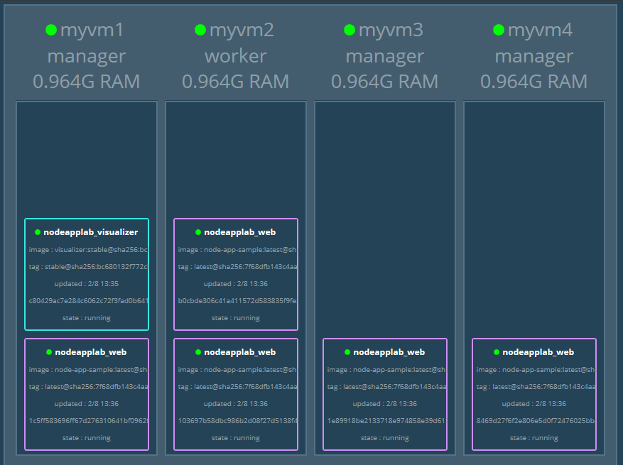

# Docker Swarm Sample
Docker swarm sample with NodeJS app on Hyper-V

## <a name="prerequisites"></a>Prerequisites
* This sample is using Hyper-V



### 1. Clone sample repository
```
git clone https://github.com/wswijaya/docker-swarm-node-app.git
```

### 2. Build Docker Image and push to Docker Hub
```
docker build -t <your docker id>/node-app-sample .
docker push <your docker id>/node-app-sample
```

### 3. Create VMs
```
docker-machine create -d hyperv --hyperv-virtual-switch "myswitch" myvm3
docker-machine create -d hyperv --hyperv-virtual-switch "myswitch" myvm2
docker-machine create -d hyperv --hyperv-virtual-switch "myswitch" myvm3
docker-machine create -d hyperv --hyperv-virtual-switch "myswitch" myvm4
```

### 4. Create Docker Swarm and set VM1, VM3, and VM4 as manager
```
docker-machine ssh myvm1 "docker swarm init"
docker-machine ssh myvm1 "docker swarm join-token manager"
docker-machine ssh myvm3 "docker swarm join --token <token> <ip>:<port>"
docker-machine ssh myvm4 "docker swarm join --token <token> <ip>:<port>"
docker-machine ssh myvm1 "docker swarm join-token worker"
docker-machine ssh myvm2 "docker swarm join --token <token> <ip>:<port>"
```

### 5. Deploy Services
```
docker-machine scp docker-compose-node-app.yml myvm1:~
docker-machine ssh myvm1 "docker stack deploy -c docker-compose-node-app.yml nodeapplab"
docker-machine ssh myvm1 "docker stack ps nodeapplab"
```

### 6. Test Site
* Node Web App: `http://<ip>:4000` or `http://<ip>:4000/api`
* Docker Visualizer: `http://<ip>:9090`

### 7. Remove Services
```
docker-machine ssh myvm1 "docker stack rm nodeapplab"
```

### 8. Remove Docker Swarm
```
docker-machine ssh myvm1 "docker stack rm nodeapplab"
docker-machine ssh myvm2 "docker swarm leave"
docker-machine ssh myvm3 "docker swarm leave --force"
docker-machine ssh myvm4 "docker swarm leave --force"
docker-machine ssh myvm1 "docker swarm leave --force"
```

### Optional: Configure Load Balancer using HAProxy
Steps

Sample config file

